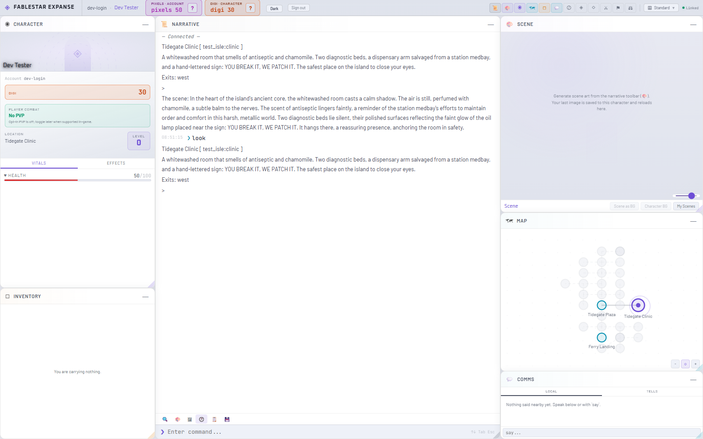
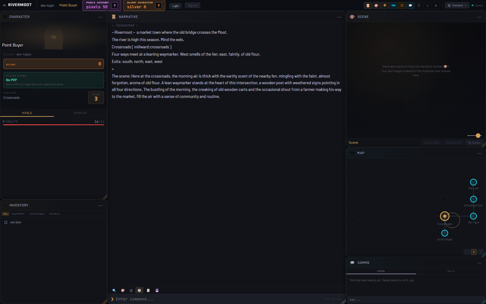
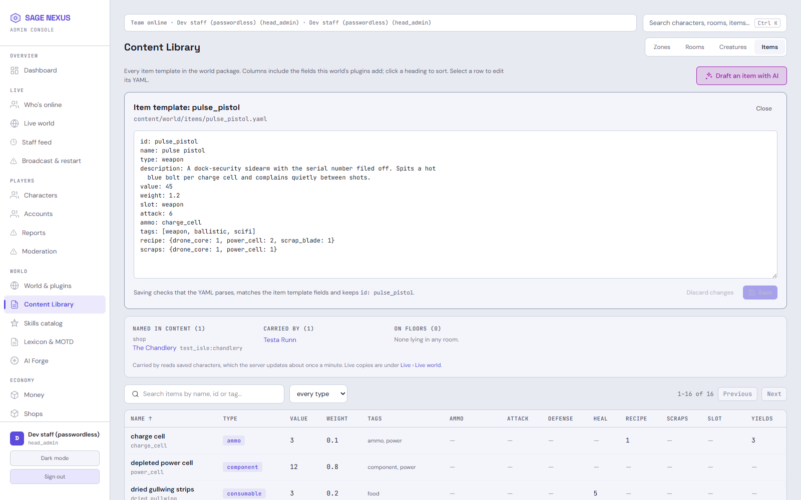
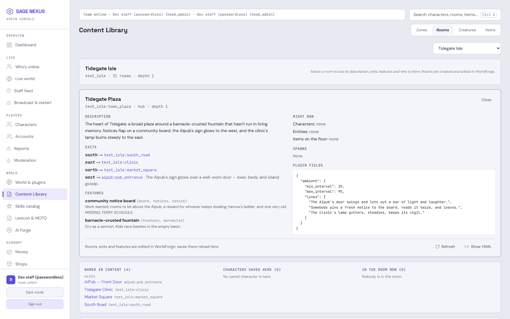
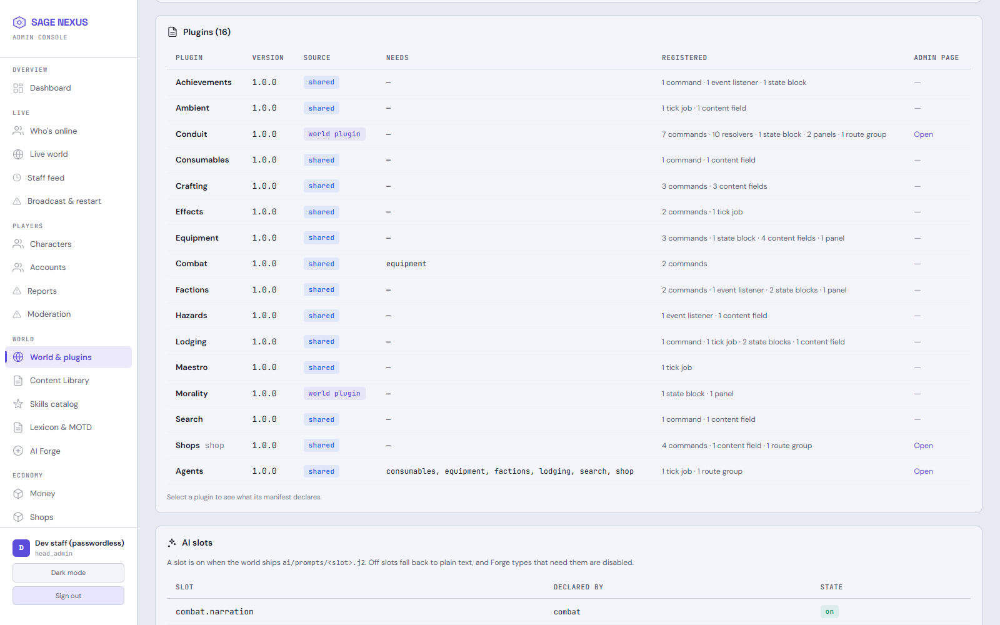
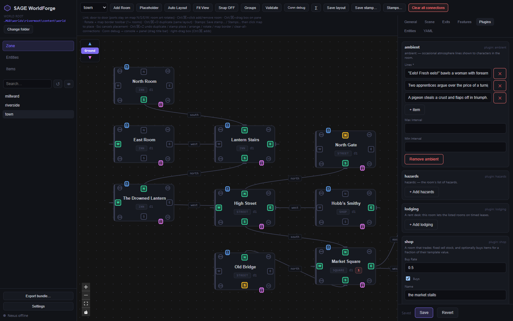

# SAGE — Synthetic Agent Game Engine

[](https://github.com/Fablestarexpanse/sage-engine)
[](engine/LICENSE)

SAGE is an engine for text worlds: MUDs with deterministic game logic, optional local-LLM
narration, AI art, computer-controlled characters, and editors for building places visually.
The engine knows nothing about any particular setting. A **world package** brings the rooms,
stats, currency, words, AI voice and look. **Plugins** bring the mechanics: combat, shops,
factions, crafting, levels.

**Golden rule:** LLMs describe what happened. Deterministic code decides what happens.

A new install runs **SAGE Demo** (`worlds/demo`), four plain rooms with no plugins, so there is
something to walk around straight away. Two reference worlds show what the same engine code can
carry:

| | Fablestar Expanse | Rivermoot |
|---|---|---|
| Setting | dark sci-fi island of salvage and ritual tech | muddy low-fantasy river town |
| Attributes | five (Fortitude, Reflex, Acuity, Resolve, Presence) | three (Might, Wits, Nerve) |
| Progression | Conduit: a 278-skill proficiency tree | levels from experience |
| Currency | digi | silver |
| Plugins | 16, including agents, factions, crafting, Conduit | 10, including shop, lodging, equipment, levels |
| AI | narration, portraits, scene art | text narration only |

## Screenshots

**Fablestar Expanse in the player client:** narrative, character sheet, zone map and scene panel.



**Rivermoot on the same client:** its own name, mark, brass accent, currency and level panel.



### Building a world in the admin console

**Item templates:** the YAML editor for one template (saves are checked before anything is
written), what uses it across the world and who carries one, and every item as a sortable table.
The attack, slot, heal, recipe and scraps columns come from the world's plugins, not console code.



**A room:** description, exits, features, spawns and plugin fields as the game loads them, what
is in it right now, and every other room whose exits lead here. Rooms are drawn in WorldForge; the
console reads them.



**World & plugins:** the plugins the world loaded, what each one registered, and which come with
their own admin page.



**WorldForge editing Rivermoot's town:** room types come from the world, and the Plugins tab is a
form generated from the plugins' content schema (ambient lines, hazards, lodging, a market shop).



## Features

- **Deterministic core.** 4 Hz tick loop, Redis for live state, PostgreSQL for persistence, one
  database per world.
- **World packages.** `worlds/<id>/` holds `world.toml`, stats, currencies, content, lexicon
  (every player-facing string), AI prompts and style, ComfyUI graphs, UI theme and world-only
  plugins. Switching worlds is one config line.
- **Plugins.** Mechanics register through a sealed `sage.api`: commands, events, resolver slots,
  state blocks, content fields, panels, AI slots, routes and their own migrations. A plugin that
  touches anything it did not declare fails at boot.
- **Hot reload.** Room YAML and command handlers reload without a restart.
- **Optional AI.** LM Studio, Ollama or an OpenAI-compatible endpoint narrate rooms and fights;
  every call has a plain fallback, so a world runs with no model at all. ComfyUI makes portraits
  and scene art against a per-account credit ledger.
- **Clients and tools.** A player client, the Nexus admin console, the WorldForge desktop editor,
  and worldforge-mcp map tools for LLM-driven building. Every one of them reads the running
  world instead of assuming Fablestar.
- **Running a world.** The admin console is laid out by staff job (see below), and players whose
  account wears the GM crown get in-game staff commands backed by a console staff account. Every
  staff change, in the console or in game, lands in one audit log.

## Quick start

Prerequisites: **Python 3.11+**, **Node.js LTS**, **Docker** (it runs Redis and PostgreSQL).

```bash
git clone https://github.com/Fablestarexpanse/sage-engine && cd sage-engine
python -m venv .venv && . .venv/bin/activate      # Windows: .venv\Scripts\activate
pip install -e ./engine
sage quickstart
```

`sage quickstart` does the rest in one terminal, and a second run changes nothing that is already
done:

1. writes `.env`, `config/server.toml` and `config/database.toml` if they are missing, with a
   generated database password and JWT secret (existing files are never changed);
2. starts Redis and PostgreSQL with `docker compose`;
3. creates the world's database (`sage_demo` for the demo world);
4. applies the engine and plugin migrations;
5. builds the player client when it has not been built or its sources changed;
6. runs the server with the **SAGE Demo** world, four rooms to walk around in.

Open http://localhost:8001/ (the server serves the built player client) and press **Play**. New to
text worlds? [`docs/tutorial/01-run-the-engine.md`](docs/tutorial/01-run-the-engine.md) walks
through this step by step and ends with changing a room while the server runs. The
generated `server.toml` is for local development: `dev_mode` is on (it seeds the `staff` and
`player` test logins) and so are the passwordless loopback logins described below.

Options: `--world rivermoot` runs another world (in its own database, `sage_rivermoot`),
`--no-docker` uses Postgres and Redis you already run, `--no-client` skips the client build,
`--no-server` stops before starting the server.

### Doing it by hand

```bash
pip install -e "./engine[dev]"                      # [dev] adds the test and lint tools
cp config/server.example.toml config/server.toml
cp config/database.example.toml config/database.toml
echo "POSTGRES_PASSWORD=choose-a-strong-password" > .env   # and the same password in config/database.toml
# The server refuses to start without a JWT secret while admin auth is on:
python -c "import secrets; open('config/server.toml', 'a').write(f'\nadmin_jwt_secret = \"{secrets.token_hex(32)}\"\n')"
docker compose up -d redis postgres
python -m sage db create                            # the database named in config/database.toml
python -m sage db upgrade
python -m sage                                      # Nexus, port 8001
```

`npm run build` in `engine/clients/player-ui` puts the player client at http://localhost:8001/. For
client development with hot reload, run the Vite dev servers instead, each in its own terminal:

```bash
# Player client -> http://localhost:5173
cd engine/clients/player-ui && npm install && VITE_NEXUS_PORT=8001 npm run dev -- --port 5173 --host

# Admin console -> http://localhost:5174
cd engine/clients/admin-ui && npm install && VITE_API_BASE=http://localhost:8001 VITE_WS_BASE=ws://localhost:8001 npm run dev -- --port 5174 --host
```

On PowerShell, set the variables first (`$env:VITE_NEXUS_PORT="8001"`), then `npm run dev`.

**Choosing a world.** `config/server.toml` sets `world = "demo"` (from the example). Each world keeps
its own database, so to run Rivermoot beside it, give it one and a port:

```bash
SAGE_SERVER__WORLD=rivermoot SAGE_DATABASE__DATABASE=sage_rivermoot python -m sage db upgrade
SAGE_SERVER__WORLD=rivermoot SAGE_DATABASE__DATABASE=sage_rivermoot SAGE_SERVER__WEBSOCKET_PORT=8002 python -m sage
```

(Create its database first with `python -m sage db create --world rivermoot`; `--world` on any
`db` command uses that world's own `sage_<id>` database. `sage quickstart --world rivermoot` does
all of it.)

<!-- DEV-AUTH:BEGIN -->
**Testing without passwords (development only).** With `dev_mode = true` and `dev_login = true`
in `server.toml`, loopback clients skip passwords: the player client's sign-in page can play a named
test character or open the character chooser, and the admin console's sign-in page can log in as a
head admin. Never enable either on a networked host. This is not a release feature:
`python scripts/release_check.py --strip` removes it (see
[`docs/dev/DEV_AUTH.md`](docs/dev/DEV_AUTH.md)).
<!-- DEV-AUTH:END -->

**WorldForge** (desktop editor): `cd engine/tools/worldforge && npm install && npm run tauri dev`.
It needs the [Tauri prerequisites](https://tauri.app/start/prerequisites/) (Rust toolchain). Open the
repository root and pick a world.

## Running a world

The Nexus admin console (http://localhost:5174 in development) groups its pages by what staff are
doing. A staff member only sees the pages their tools allow; head admins set tools and zones under
**Team & access**, starting from the Builder, Game master, Moderator or Operator presets.

| Group | Pages |
|---|---|
| Live | Who's online, Live world (who is in each room, live creatures, items on floors), Staff feed, Broadcast & restart |
| Players | Characters (sheet, move, money, items, undo history), Accounts (suspend, mute, sign-ins), Reports, Moderation |
| World | World & plugins, Content Library (rooms, and sortable item and creature tables), Skills catalog, Lexicon & MOTD, AI Forge |
| Economy | Money, Shops, AI art credits |
| NPCs | Agents |
| System | Server & AI models, Team & access, Audit log |

**Ctrl+K** searches characters, accounts, rooms, items, creatures and lexicon lines from any page,
and every room, item and creature shows what uses it. Rooms and zones are made in WorldForge; the
console reads them.

Staff changes to a character (move, money, items, vitals) take a snapshot first, so any of them can
be undone from the character's History. A scheduled restart warns players, closes sign-ins in the
last minute, saves everyone and stops the server; your process manager or Docker restart policy
starts it again.

**In the game.** Players send bug reports, typos and ideas with `report <text>`; staff work through
them under Players › Reports. A player has staff commands (`goto`, `at`, `where`, `stat`,
`transfer`, `restore`, `mute`, `unmute`, `staff`) when their account wears the GM crown **and** an
active console staff account has the same name. That staff account's tools and zones decide what
each command may do, and to everyone else the commands do not exist.

## Building a world

Start one with `python -m sage world new mytown --name "My Town"`. It writes a package with one
start room and no map, checks that it validates, and prints the next steps: draw the map in
WorldForge, then `sage quickstart --world mytown` (or `python -m sage db create --world mytown`
and `python -m sage db upgrade --world mytown` on a setup that is already running). Worlds made
this way are gitignored; a world meant to ship needs a `.gitignore` exception and a `NOTICE` entry.

```
worlds/<id>/
  world.toml            id, name, start and respawn rooms, room types, exit directions,
                        equipment slots, enabled plugins and their params
  stats.yaml            attributes, vitals, character-creation point budget
  currencies.yaml       in-world money
  content/world/        zones/<zone>/rooms/*.yaml, entities/, items/
  lexicon/en.yaml       overrides for any engine or plugin string
  ai/                   prompts/<slot>.j2, style.yaml, comfyui/*.json
  ui/theme.yaml         the client's mark and accent colours
  plugins/<id>/         plugins only this world uses
  content.schema.json   exported content schema for offline editors
```

Useful commands while building:

```bash
python -m sage validate --world rivermoot           # dangling exits, unknown templates, undeclared types
python -m sage schema export --world rivermoot --out worlds/rivermoot/content.schema.json
python -m sage plugin uninstall <plugin> [--purge-state]
```

The contracts for packages and plugins are in [`docs/sage/PHASE1_CONTRACTS.md`](docs/sage/PHASE1_CONTRACTS.md),
and the rulings behind them in [`docs/sage/DECISIONS.md`](docs/sage/DECISIONS.md).

## Configuration

TOML files in `config/` are merged at startup; the live files are gitignored, so copy them from
the `*.example.toml` files. Environment variables override any key with the `SAGE_` prefix and
double-underscore nesting (`SAGE_SERVER__WEBSOCKET_PORT=8001`).

- `admin_auth_required = true` (default): every admin route needs a staff Bearer token. Never
  disable it on a networked host.
- `admin_jwt_secret`: required when auth is on. Generate one with
  `python -c "import secrets; print(secrets.token_hex(32))"`.
- Optional: `llm.toml` (narration backend), `comfyui.toml` (art generation, AI credit costs and
  purchase bundles), `agents_llm.toml` (agent characters), `moderation.toml` (whether new accounts
  may register, sign-in history and report cooldown; the console's Moderation page writes it).
- **Sign-in addresses are not recorded unless you turn it on** (Players › Moderation). They are
  personal data in many countries, so check the rules that apply to you first. While recording is
  on, the sign-in screens tell players, history is deleted after `login_history_days`, and staff
  can erase an account's addresses. Address bans work either way. Behind a reverse proxy the
  server sees the proxy's address, so bans and history need the real client address passed
  through at the network level.

Create the first head admin with
`python engine/scripts/bootstrap_admin.py --username youradmin --password 'a-strong-password'`.
Head admins manage staff, tool access and zone permissions from **Team & access** in the admin
console.

Do not expose Nexus directly to the internet: put it behind a reverse proxy with TLS.

## Development

```bash
python -m pytest                                    # hermetic suite, no services needed
SAGE_LIVE_TESTS=1 python -m pytest -m live          # migrations, persistence, both worlds booting and playing
python scripts/sage_invariants.py check             # world terms and hardcoded player text in engine code may only go down
python scripts/notice_check.py                      # every top-level path and world package has license terms in NOTICE
(cd engine/tools/worldforge && npx vitest run)      # WorldForge unit and render tests
```

CI runs all of these plus a license report on every push. Developer guides:
[`docs/architecture.md`](docs/architecture.md) (how it fits together), [`docs/dev/`](docs/dev/) (standards,
workflow, milestones) and [`CHANGELOG.md`](CHANGELOG.md).

## Project layout

```
engine/src/sage/            the engine (python -m sage)
engine/tests/               hermetic and live tests
engine/alembic/             core migrations
engine/clients/player-ui/   player client (React, Vite)
engine/clients/admin-ui/    Nexus admin console (React, Vite)
engine/tools/worldforge/    WorldForge desktop editor (Tauri)
engine/tools/worldforge-mcp/  MCP map-building tools
plugins/                    first-party plugins
worlds/demo/                SAGE Demo, the four-room world a new install runs
worlds/fablestar/           Fablestar Expanse world package (proprietary)
worlds/rivermoot/           Rivermoot reference world
scripts/                    invariant ratchet, NOTICE and release checks, license report
docs/                       contracts, decisions, standards, milestones
```

## License

The SAGE engine is licensed under the Functional Source License, Version 1.1, ALv2 Future License
(`FSL-1.1-ALv2`); see [`engine/LICENSE`](engine/LICENSE) and the plain-English
[`LICENSE-FAQ.md`](LICENSE-FAQ.md). Each release becomes Apache-2.0 two years after it is
published. First-party plugins (`plugins/`), SAGE Demo and Rivermoot ship under the same license.

Fablestar Expanse world content, lore, art and branding are proprietary, all rights reserved.
[`NOTICE`](NOTICE) lists which paths are which.
